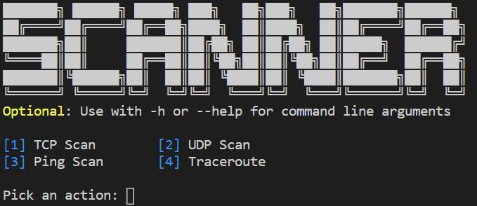
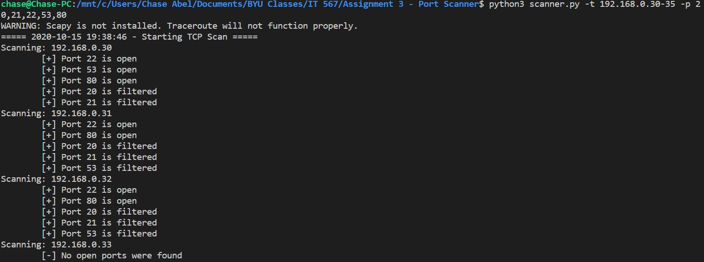
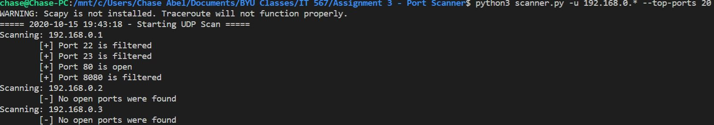
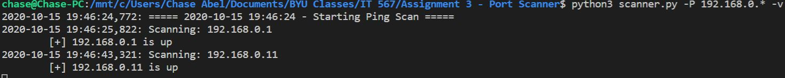
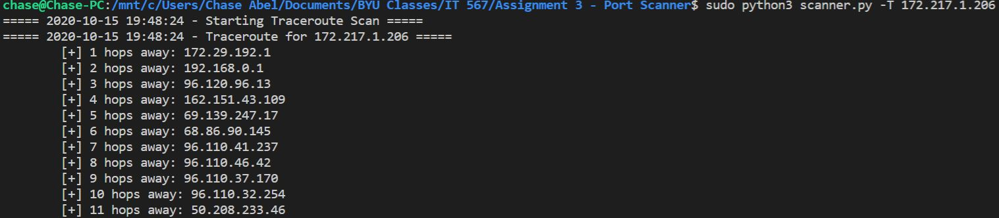
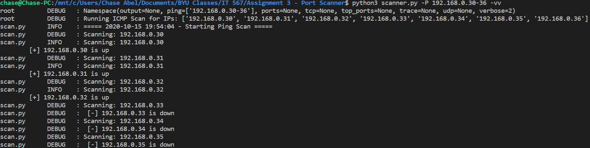

<br />
<p align="center">
  <h3 align="center">Simple Port Scanner</h3>
  <p align="center">
    A Simple Port Scanner for IT 567.
    <br />
  </p>
</p>


<!-- TABLE OF CONTENTS -->
## Table of Contents

* [About the Project](#about-the-project)
  * [Built With](#built-with)
* [Getting Started](#getting-started)
  * [Prerequisites](#prerequisites)
* [Usage](#usage)
* [Screenshots](#screenshots)


<!-- ABOUT THE PROJECT -->
## About The Project



This project was meant to make port scanning simple. It currently offers the following features:

* TCP Scanning
* UDP Scanning
* ICMP Scanning
* Traceroute

### Built With
* [Python 3](https://www.python.org/)

<!-- GETTING STARTED -->
## Getting Started

I tried to keep this scanner as simple as possible, so there is only one python package that needs to be installed to run the program: scapy. If you do not wish to use the traceroute functionality, then this package is not necessary.

### Prerequisites
The required packages can be installed with:
```
pip3 install -r requirements.txt
```
Or you can install the required packages manually with the following commands:
* scapy
```
pip3 install scapy
```

<!-- USAGE EXAMPLES -->
## Usage

The following arguments are accepted:
### Scan Types
* -t, --tcp
  * A TCP scan is conducted (Must be accompanied by --ports or --top-ports)
* -u, --udp
  * A UDP scan is conducted (Must be accompanied by --ports or --top-ports)
* -P, --ping
  * An ICMP scan is conducted
* -T, --T
  * A traceroute is conducted

**Each of the above commands must be followed by an IP address or range of IP addresses.** IPs can be given as follows:

`192.168.2.15,192.168.2.16`

`10.50.60-63.1-100`

`192.168.*.*`

`172.16.0.0/16`

*The above syntax can also be applied to the --ports flag*

### Options

* -v, -vv
  * Verbose mode is enabled (-vv enables debug mode)
* -p, --ports
  * The provided ports will be scanned (see IP flag above for syntax)
* --top-ports (20 | 1000)
  * The most common 20 or 1000 ports will be scanned
* -o, -output
  * Outputs the scan results to a file
* -h
  * Displays the help menu and argument requirements

  
## Screenshots

### TCP Scan


### UDP Scan


### ICMP Scan


### Traceroute


### Debug Mode



